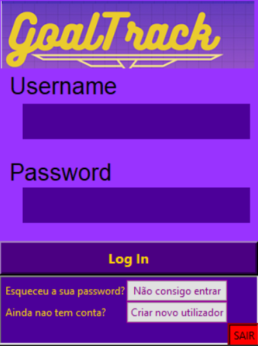
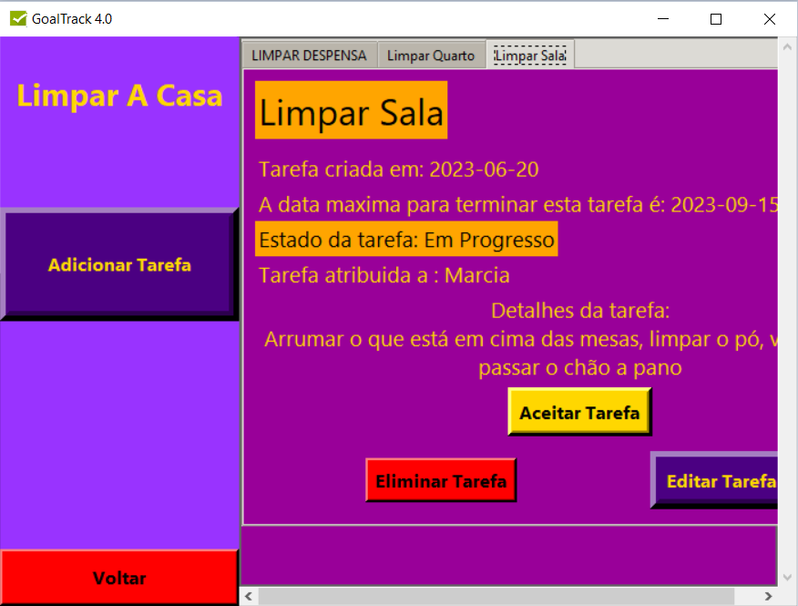

# Project Name: GoalTrack App

# Description:
This Goal Tracker App is a small, self-developed project aimed at improving my skills in Python, SQL, and GUI development using tkinter.
It serves as a practical demonstration of my proficiency in these technologies and showcases my ability to create functional, user-friendly applications.

# Key Features:

# Goal Management: 
- Create, update, and delete your goals easily.
- Database Integration: Utilizes SQL to store and manage goal data efficiently.
- User-Friendly GUI: The tkinter-based graphical user interface ensures a smooth and intuitive user experience.
- Progress Tracking: Keep track of your goals' progress and completion status.
- Learned Skills: Through the development of this project, I gained valuable insights and practical experience in various areas, including:
  - Proficiency in SQL database management and data manipulation.
  - Advanced Python programming skills, including data validation, error handling, and working with external libraries.
  - Implementation of security measures, such as password encryption, to ensure data privacy and protection.
  - Strategies for preventing SQL injection by encapsulating SQL code within Python, enhancing database security and integrity.
- Learning Objectives:

## Deepened understanding of SQL databases.
Enhanced Python programming skills.
Proficiency in developing GUI applications using tkinter.
Practical experience in project planning and development.

## Project Status:
This project was created exclusively for learning purposes. While it has served its intended educational goals, it may not undergo further development or enhancements.
Your feedback and contributions, though appreciated, may not be actively solicited for this particular project..

## Screenshots:

  
  

    
    

## How to Run:
To use the application without errors, follow these steps:
1. **Create the Database:** Use the provided Python program to create the database and its respective tables. You can find this program in the `criador_bd_e_tb.py` file.
2. **SQL Server Requirement:** Please note that you will need an SQL server like XAMPP to host the database. You can download XAMPP [here](https://www.apachefriends.org/index.html).
3. **Sample Data (Optional):** The program includes an option to add three goals and some tasks to the database, making it easier to visualize how the application functions.
4. **Database Prototype:** Inside the `goaltrack` folder, you'll find the first draft of how the database was prototyped. Check out the `.drawio` file to get insights into the database structure.
This guide will help you set up and run the Goal Tracker App seamlessly.

## Future Enhancements:
(I'm not sure if im going to revisit this project since it was just for learning purposes)

## Acknowledgments:
tkinter: For the visual interface.
ttk and messagebox: Handling pop-up messages.
mysql.connector: Enabling database connections.
Pillow (PIL): Managing images.
hashlib: Ensuring password security.
datetime.date: Accurate date management.
This shorter version still conveys your acknowledgment of the libraries and resources you used in your project.
License:
This project is open-source and available under the [License Name] license. Feel free to use and modify it in accordance with the license terms.

## Contributions:
Contributions, bug reports, and feature requests are welcome. Please feel free to create issues or pull requests.
